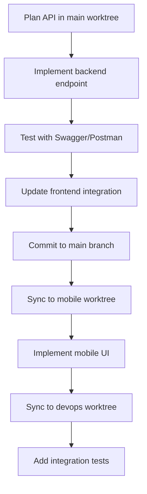
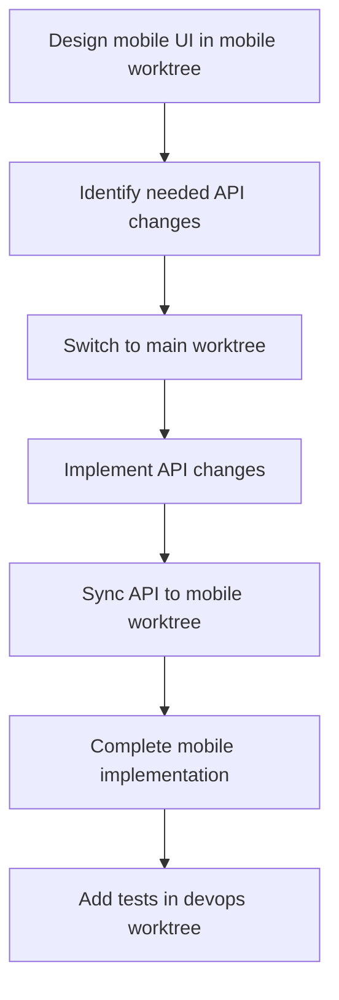

# 🛠️ Development Workflow Guide

## Overview
This guide explains when and how to use each worktree for different types of development work.

## 🌳 Worktree Purposes

### 1. Full-Stack Web Development (`/Applications/Projects/saas-app`)
**Branch**: `main`  
**Use for**:
- React frontend development (Vite + TypeScript)
- NestJS backend API development
- Database schema changes
- Socket.io real-time features
- Authentication system changes
- Core business logic implementation
- API endpoint creation and modification

**Development Flow**:
```bash
# Terminal 1: Backend
cd backend
npm run dev

# Terminal 2: Frontend  
cd frontend
npm run dev

# Terminal 3: Database
mongod

# Terminal 4: Redis
redis-server
```

### 2. Mobile App Development (`/Applications/Projects/saas-app-mobile`)
**Branch**: `feature/mobile-development`  
**Use for**:
- React Native + Expo development
- Mobile UI/UX implementation
- Native feature integration (camera, location, push notifications)
- App Store and Play Store builds
- Mobile-specific performance optimization
- Offline functionality
- Platform-specific code (iOS/Android)

**Development Flow**:
```bash
# Ensure backend is running in main worktree first
cd /Applications/Projects/saas-app/backend
npm run dev

# Then start mobile development
cd /Applications/Projects/saas-app-mobile
npm run dev
```

### 3. DevOps & Testing (`/Applications/Projects/saas-app-devops`)
**Branch**: `feature/devops-testing`  
**Use for**:
- CI/CD pipeline development
- Docker containerization
- AWS infrastructure management
- Testing strategy implementation
- Security scanning and vulnerability assessment
- Performance testing and optimization
- Deployment automation
- Monitoring and logging setup

**Development Flow**:
```bash
# Testing
npm run test:all

# Docker development
docker-compose up

# Infrastructure deployment
terraform plan
terraform apply
```

## 🔄 Workflow Patterns

### 1. Feature Development Workflow

#### New API Feature Development


**Steps**:
1. **Main Worktree**: Design and implement API
2. **Main Worktree**: Test API with frontend
3. **Mobile Worktree**: Consume API in mobile app
4. **DevOps Worktree**: Add comprehensive tests

#### Mobile-First Feature Development


### 2. Daily Development Patterns

#### Morning Startup Routine
```bash
# 1. Start main worktree services
cd /Applications/Projects/saas-app
git pull origin main
# Start MongoDB, Redis, Backend, Frontend

# 2. Update mobile worktree
cd /Applications/Projects/saas-app-mobile
git fetch origin main && git merge origin/main

# 3. Update devops worktree
cd /Applications/Projects/saas-app-devops
git fetch origin main && git merge origin/main
```

#### Feature Work Decision Tree
```
📝 What am I working on?
├── API Changes or Backend Logic?
│   └── Use: Full-Stack Worktree (main)
├── Mobile UI or Native Features?
│   └── Use: Mobile Worktree
├── Testing or Deployment?
│   └── Use: DevOps Worktree
└── Full-Stack Feature?
    └── Start: Full-Stack → Mobile → DevOps
```

## 🎯 Development Scenarios

### Scenario 1: New User Authentication Feature

**Timeline**: 2-3 days

**Day 1 - Backend (Full-Stack Worktree)**:
```bash
cd /Applications/Projects/saas-app
# Implement JWT refresh token logic
# Update user schema
# Create auth middleware
# Test with Postman
git commit -m "feat: implement refresh token auth"
```

**Day 2 - Frontend (Full-Stack Worktree)**:
```bash
# Update login/logout components  
# Implement token refresh logic
# Update API client configuration
git commit -m "feat: frontend auth improvements"
git push origin main
```

**Day 2 - Mobile (Mobile Worktree)**:
```bash
cd /Applications/Projects/saas-app-mobile
git pull origin main
# Implement mobile auth flow
# Add biometric authentication
# Update AsyncStorage logic
git commit -m "feat: mobile auth with biometrics"
```

**Day 3 - Testing (DevOps Worktree)**:
```bash
cd /Applications/Projects/saas-app-devops
git pull origin main
# Add auth E2E tests
# Update CI pipeline
# Add security tests
git commit -m "test: comprehensive auth testing"
```

### Scenario 2: Real-time Chat Feature

**Timeline**: 3-4 days

**Day 1-2 - Socket.io Implementation (Full-Stack Worktree)**:
- Backend: WebSocket gateway, message handling
- Frontend: Socket.io client, chat UI

**Day 3 - Mobile Chat (Mobile Worktree)**:
- Mobile chat interface
- Push notification integration
- Background app handling

**Day 4 - Testing & Deployment (DevOps Worktree)**:
- WebSocket load testing
- Real-time message delivery tests
- Scaling configuration

### Scenario 3: Bug Fix Workflow

**Hot Fix Process**:
```bash
# 1. Identify issue location
# 2. Fix in appropriate worktree
# 3. Test fix
# 4. Sync to other worktrees if needed
# 5. Deploy through devops worktree
```

## 🔧 Environment Switching

### Context Switching Commands

```bash
# Quick worktree switching
alias goto-main="cd /Applications/Projects/saas-app"
alias goto-mobile="cd /Applications/Projects/saas-app-mobile"  
alias goto-devops="cd /Applications/Projects/saas-app-devops"

# Development server shortcuts
alias start-fullstack="cd /Applications/Projects/saas-app && npm run dev:full-stack"
alias start-mobile="cd /Applications/Projects/saas-app-mobile && npm run dev"
alias start-tests="cd /Applications/Projects/saas-app-devops && npm run test:watch"
```

### VS Code Workspaces

Create workspace files for each environment:

**fullstack.code-workspace**:
```json
{
  "folders": [
    { "path": "/Applications/Projects/saas-app" }
  ],
  "settings": {
    "typescript.preferences.includePackageJsonAutoImports": "auto"
  },
  "extensions": {
    "recommendations": [
      "bradlc.vscode-tailwindcss",
      "ms-vscode.vscode-typescript-next"
    ]
  }
}
```

**mobile.code-workspace**:
```json
{
  "folders": [
    { "path": "/Applications/Projects/saas-app-mobile" }
  ],
  "settings": {
    "typescript.preferences.includePackageJsonAutoImports": "auto"
  },
  "extensions": {
    "recommendations": [
      "expo.vscode-expo-tools",
      "ms-vscode.vscode-react-native"
    ]
  }
}
```

## 📊 Progress Tracking

### Feature Completion Checklist

**Full-Stack Features**:
- [ ] Backend API implemented
- [ ] Frontend UI completed
- [ ] Database migrations applied
- [ ] Authentication/authorization added
- [ ] Real-time features tested
- [ ] API documentation updated

**Mobile Features**:
- [ ] Mobile UI implemented
- [ ] API integration completed
- [ ] Native features utilized
- [ ] Offline support added
- [ ] Performance optimized
- [ ] Platform-specific testing done

**DevOps Tasks**:
- [ ] Unit tests added
- [ ] Integration tests implemented
- [ ] E2E tests created
- [ ] Security scans passed
- [ ] Performance tests executed
- [ ] Deployment pipeline updated

### Work Organization

**Use GitHub Projects/Issues**:
- Label issues with worktree: `fullstack`, `mobile`, `devops`
- Create milestone for each feature
- Link related issues across worktrees

**Example Issue Labels**:
- `type:fullstack` - Full-stack web development
- `type:mobile` - Mobile app development  
- `type:devops` - Infrastructure and testing
- `type:integration` - Cross-worktree coordination

## 🚨 Emergency Procedures

### Critical Bug Fix
1. **Identify** affected components
2. **Fix** in appropriate worktree
3. **Test** thoroughly
4. **Deploy** immediately via devops worktree
5. **Sync** fix to other worktrees

### Production Deployment
1. **Full-Stack Worktree**: Ensure main branch is stable
2. **DevOps Worktree**: Execute deployment pipeline
3. **Mobile Worktree**: Trigger EAS builds if needed
4. **Monitor**: All services post-deployment

This workflow ensures efficient development across all aspects of the application while maintaining clear separation of concerns and coordination between different development environments.